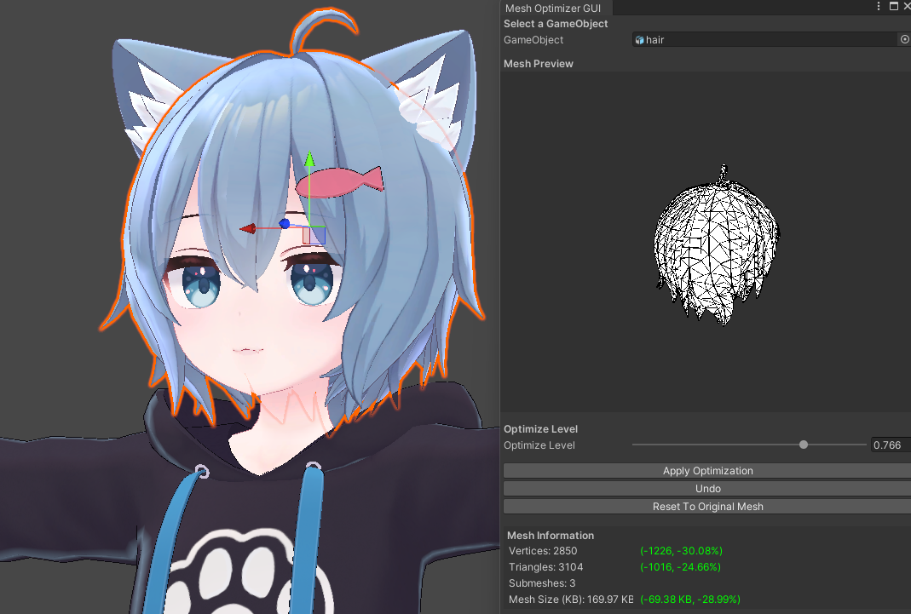
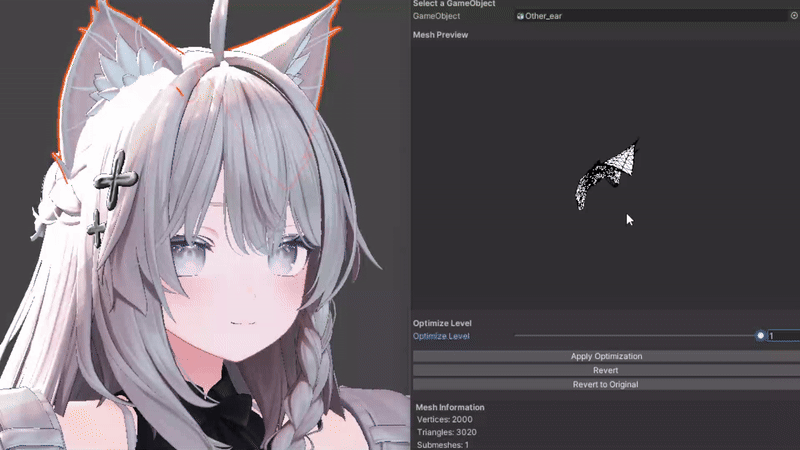

<div align="center">

# Mesh Optimizer For Unity
[](https://github.com/refiaa/MeshDecimater_Unity/releases/latest)
[](https://github.com/refiaa/MeshDecimater_Unity/releases/latest)
[](https://app.codacy.com/gh/refiaa/MeshOptimizer_Unity/dashboard?utm_source=gh&utm_medium=referral&utm_content=&utm_campaign=Badge_grade)
[](https://github.com/refiaa/MeshDecimater_Unity/issues)
[](#)

<em><h5 align="center">(using Unity 2022.3.22f1)</h5></em>



| **English** | [日本語](./README.jp.md) |

This plugin enables a functionality similar to Blender's decimate feature within Unity.

This plugin supports both `Mesh Filter` and `Skinned Mesh Renderer`. 

It can handle used on any mesh that can be imported into Unity (`.fbx`, `.glTF`, `.dae (Collada)`, `.obj`, `.GLB`, `.asset`, etc.). 

Additionally, even after optimization, BlendShapes, Bones, Bone Weights, and Sub Meshes will be preserved.

decimate functions are created by using **UnityMeshSimplifier**[[1]][UnityMeshSimplifier_github]

<div align="left">

### Installation
---

**How to Install**

1.  Download the latest release file (Unitypackage) from [here][download_link2] and import it to complete the setup.

**File Tree Structure**

tree have to looks like this

```sql
Assets
├─ *UnityMeshSimplifier* // Should be here !
└─ MeshDecimater_Unity // MeshOptimizer_Unity directory name is `MeshDecimater_Unity`
   ├─  .gitignore
   │  LICENSE
   │  VERSION
   │
   ├─Editor
   │      DecimaterMain.cs
   │      DecimaterMain.cs.meta
   │      MeshInfoDisplay.cs
   │      MeshInfoDisplay.cs.meta
   │      MeshPreviewer.cs
   │      MeshPreviewer.cs.meta
   │      MeshRevertManager.cs
   │      MeshRevertManager.cs.meta
   │      UpdateNotifier.cs
   │      UpdateNotifier.cs.meta
   │      WireframeDrawer.cs
   │      WireframeDrawer.cs.meta
   │
   ├─Runtime
   │      MeshDecimaterUtility.cs
   │      MeshDecimaterUtility.cs.meta
   │      MeshUtils.cs
   │      MeshUtils.cs.meta
   │
   └─Shader
         Wireframe.shader
         Wireframe.shader.meta

```

### How to use
---



Select an object with a mesh from the Hierarchy or choose it from the ObjectField to use the plugin.

Similar to Blender, adjust the `Decimate Level` and press `Apply Decimation` to execute the decimation.

Clicking `Revert` will restore the original file.

Please note that Revert will not work after clicking on a different object (the original mesh will remain, so you can replace it to restore).

### Update History
---

v0.0.1:
> • Initial release.

v0.0.2:
> • Fixed an issue where Components disappeared after Apply.

v0.0.3:
> • Resolved issues related to BlendShapes.
>
> • Fixed a problem where Skinned Mesh Renderer wasn't updating in Mesh Preview after Apply.

v0.0.4:
> • Optimized decimation for Skinned Mesh Renderer.

v0.0.5:
> • Fixed 'IndexOutOfRangeException' occurring on some models.
>
> • Resolved issues with tangent duplication and calculation.

v0.0.6:
> • Changed preview material from external reference to internal code generation.

v0.0.6.2:
> • Fixed an issue where Material and Wireframe weren't loading in some cases.
>
> • Improved mesh information after decimation.
>
> • Enhanced display of mesh size reduction.

v0.0.7:
> • Fixed `FileNotFoundException Error`.

v0.0.8:

・Resolved a problem where submesh material count became 1 after decimation.

・Changed display method
> Modified wireframe shader.
> 
> Fixed an issue where preview material wasn't applied to submeshes.

・Fixed an issue where decimated objects disappeared when uploaded to VRC
> Now the actually decimated object is saved.

v0.0.9:

> Change name "Decimate" to "Optimizer" 
>
> `Revert to Original` Added.
> 
> `Optimize(decimate) level` is now save globally

v0.0.9.1:

> Minor Bug fixes

v0.0.9.2:

> Bug fix ; 
>
> - Fix Mesh vanishing problem cause by `(Clone)` and `_Decimated`.
>
> - Fix SkinMeshRenderer issue in apply optimization
>
> - Fix Revert Button to undo 
>
> - Change name of some GUI (`Revert` to `Undo`, `Revert to Original` to `Reset To Original Mesh`)

v0.0.9.3:

> - Add update notification function
> 
> - Minor Bug fixes

```
work confirmed in

・Unity 2022.3.22f1

・Unity 2019.4.31f1
```

<!-- links -->
  [UnityMeshSimplifier_github]: https://github.com/Whinarn/UnityMeshSimplifier
  [download_link]: https://github.com/Whinarn/UnityMeshSimplifier/releases/tag/v3.1.0
  [download_link2]: https://github.com/refiaa/MeshDecimater_Unity/releases/latest

